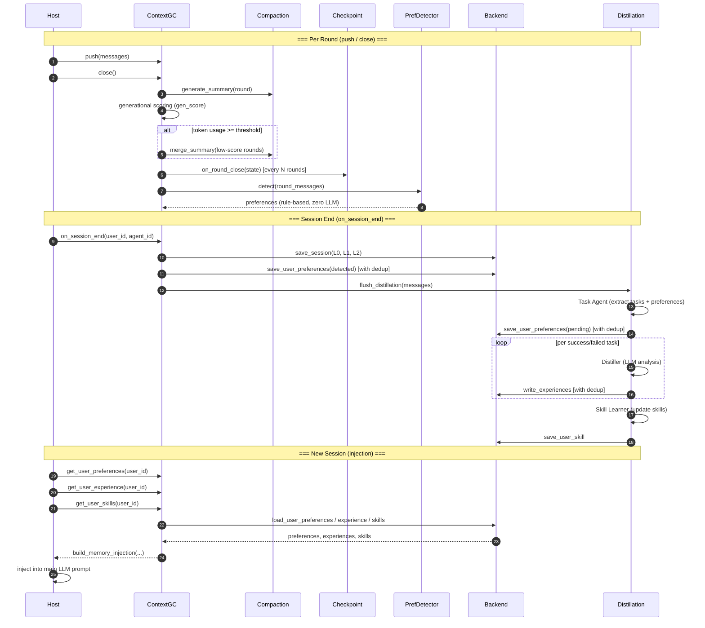

<div align="center">


# Context GC

**Context Metabolism & Memory Sedimentation Engine for LLM Agents**

*Compress · Persist · Distill · Inject — the complete lifecycle for production LLM applications*

<br>

[](https://github.com/4XII-Khan/Context-GC/releases)
[](https://www.python.org/downloads/)
[](LICENSE)
[](tests/)
[](#)

<br>

<code>Python</code> · <code>AsyncIO</code> · <code>Model-Agnostic</code> · <code>Zero Dependencies</code> · <code>Pluggable Backend</code>

<br>

[Design Doc](docs/design/memory-system.md) · [Why](#-why-context-gc) · [Quick Start](#quick-start) · [Features](#core-capabilities) · [Sequence Diagram](#-complete-sequence-diagram) · [Benchmarks](#100-round-integration-test) · [Docs](#documentation)

<br>

**Generational Compression** · **L0/L1/L2 Memory** · **Distillation Pipeline** · **Crash Recovery** · **Skill Learning**

<br>

[English](README.md) · [中文](README.zh-CN.md)

</div>

---

## 🌰 Why Context GC?

**Context GC** treats context as a *recyclable resource*: retain by relevance, metabolize by age, distill by value. Memory that compounds—not just longer, but **deeper**.

LLM context windows are finite, but conversations grow without bound. Existing solutions either **truncate blindly** (losing critical context), **summarize everything equally** (wasting tokens on irrelevant history), or **require external vector databases** (adding infrastructure complexity). Context GC takes a fundamentally different approach: treat context management as a **garbage collection problem** — keep what matters, compress what's aging, and recycle knowledge into long-term memory.

---

## ✨ Core Capabilities

**Selective memory is what approaches understanding.** Unselective memory is storage; selective memory approximates comprehension. Context GC asks: what kind of memory makes an agent seem to *understand*, not just recite? The answer: memory that distinguishes important from secondary, metabolizes and sediments over time, and carries over into new sessions. Not for length—for structure and continuity.

### 1. In-Session Compression

**From truncation to metabolism.** Human memory is metabolic: the important stays, the trivial is compressed or forgotten—but forgetting isn't loss, it shapes intuition. LLMs had only two modes: remember everything, or cut it off. Context GC adds a third: *metabolize*. Low-relevance rounds are merged into refined summaries, not discarded; the compressed is form, what continues is cognition. Relevance is dynamic—conversation flows (A → B → back to A); uniform treatment ignores that flow. Generational scoring preserves "what matters now" and settles "what matters long-term." *Forgetting is choice, not loss.*

Sustain long conversations within a fixed context window via **generational garbage collection** — semantically score rounds by relevance, retain high-value context, merge low-value history.

| Capability | Description |
| ---------- | ----------- |
| **Incremental Summarization** | Each round produces a structured summary (theme, key points, conclusion); input = prior summaries + current round messages |
| **Generational Scoring (`gen_score`)** | Relevance ranked per round: top 50% → old-generation (+1), bottom 50% → new-generation (−1); clamped ±1 per round for smooth decay |
| **Capacity-Triggered Merging** | When token usage hits configurable thresholds (20%/30%/40%…), low-`gen_score` rounds are adjacent-merged via `merge_summary`; high-score rounds preserved |
| **Step-Based Scoring** | Score every N rounds instead of every round; intermediate rounds reuse prior `gen_score` — reduces LLM calls for relevance |
| **Automatic Pipeline** | Both summarization and merging run inside `close()`; host only pushes messages and calls `close()` per round |

### 2. Session-Level Memory Persistence

**From consumption to cultivation.** Raw context is one-time fuel: use it, it's gone. Context GC turns it into cultivable soil: **compress** the current into reusable structure, **persist** into L0/L1/L2 for retrieval and retrospection, **distill** preferences/experiences/skills from sessions, **inject** so new sessions start with that sediment. Each conversation feeds the next; knowledge compounds. Nothing is thrown away—it's layered for reuse.

Persist conversation state at session end into a **three-tier retrieval hierarchy**; enable cross-session search without vector DB.

| Capability | Description |
| ---------- | ----------- |
| **L0 / L1 / L2 Layered Storage** | **L0** (~50–200 tokens): coarse summary of L1 for fast screening; **L1**: full GC summary list for detailed navigation; **L2**: raw conversation (on-demand load) |
| **Checkpoint & Crash Recovery** | Incremental checkpoint every N rounds; process crash → resume from last checkpoint without data loss |
| **In-Session Preference Detection** | At `close()`: zero-LLM-cost keyword/regex detection for explicit preferences; matches written immediately to user preferences |
| **Cross-Session Keyword Search** | FTS5 / BM25 full-text search over L0/L1; no embeddings, no vector DB; filter sessions by user/agent |

### 3. Memory Distillation & Long-Term Learning

**From sessions to relationship.** A single session is a point; a relationship is a line. If every conversation starts from zero, there's no sense of relation. Context GC aims for the agent to maintain cognition of the user across sessions—preferences, habits, success and failure patterns. The user no longer repeats "I prefer concise" or "don't use var"; the agent gradually *knows* them. This isn't optimizing a function—it's designing a sustainable human–agent relationship.

Extract **user preferences**, **experiences**, and **personalized skills** from completed sessions via a configurable distillation pipeline.

| Capability | Description |
| ---------- | ----------- |
| **Three-Stage Pipeline** | **Task Agent** → extracts tasks with success/failure labels; **Distiller** → analyzes outcomes; **Writers** → preferences, experiences, skill updates |
| **User Preferences** | Writing style, coding habits, corrections, explicit preferences; stored per user; dedup at write (`exact` / `keyword_overlap`); injected at session start |
| **User Experience** | Task-scoped success patterns and failure anti-patterns; directory per task; used for decision optimization |
| **Skills (Public & Private)** | Public: shared across users; Private: user-scoped; both updatable via distillation |
| **Deduplication & Conflict** | Semantic dedup: `exact` / `keyword_overlap` / `llm_similar`; conflict strategies: `append` / `newer_wins` / `keep_both` / `llm_merge` |
| **Memory Lifecycle** | TTL-based aging for preferences/experiences; `memory_inject_max_tokens` caps injection size |
| **Cost Budget** | Token budget for distillation pipeline; low-priority tasks auto-skipped when exceeded |

### 4. Architecture

**The philosophy of zero infrastructure: embed, don't replace.** No vector DB, no new services, zero core dependencies—Context GC is *embedded*. It doesn't replace the existing architecture; it integrates into the host, offering optional memory and compression for any agent. Good capability should be embeddable, not force the host to rebuild the world.

| Property | Description |
| -------- | ----------- |
| **Pure Library** | Host injects callbacks; no mandatory services, runs in-process |
| **Model-Agnostic** | `generate_summary`, `merge_summary`, `compute_relevance`, `estimate_tokens` are host-injected — use any LLM or heuristic |
| **Pluggable Backend** | `MemoryBackend` protocol: SQLite, filesystem, object storage, etc. |
| **Zero Dependencies** | Core uses Python standard library only; optional extras for dev/example |

---

### Context GC vs. Traditional Approaches

| Dimension | Truncation | Fixed Summarization | Vector-Retrieval Memory | ✨ Context GC |
| --------- | ---------- | ------------------- | ----------------------- | ------------- |
| **Typical examples** | Simple impl, some frameworks | Uniform per-round summarization | OpenViking, semantic-retrieval systems | This project |
| 💰 Setup Cost | None | Low | High (VectorDB) | ✅ Zero infrastructure |
| 🎯 Context Quality | ❌ Loses old context | ⚠️ Equal compression | ⚠️ Retrieval noise | ✅ Generational — keeps what matters |
| 🧠 Long-Term Learning | ❌ None | ❌ None | ❌ None | ✅ Distillation → preferences, experiences, skills |
| 🔄 Crash Recovery | ❌ None | ❌ None | N/A | ✅ Checkpoint every N rounds |
| ⚡ LLM Cost | None | High (every round) | Embedding cost | ✅ Step-based scoring, zero-LLM preference detection |

For in-depth comparison with **specific solutions** (Claude Code, OpenViking, MemGPT, etc.), see [Comparisons](docs/comparisons/claude-code.md) and the standalone docs in that directory.

---

## 🚀 Quick Start

### Installation

The core package has **zero third-party dependencies** — standard library only.

```bash
pip install -e .              # Install core package (editable mode)
pip install -e ".[dev]"       # Core + test deps (pytest, pytest-asyncio, python-dotenv)
pip install -e ".[example]"   # Core + example deps (openai, python-dotenv)
```

### Configuration (required for E2E and examples)

```bash
cp .env.example .env
# Edit .env and add CONTEXT_GC_API_KEY, etc.
```

### In-Session Compression

**Option 1: Use default adapters** (recommended for quick start)

After configuring `.env`, call `ContextGCOptions.with_env_defaults()`. LLM, token estimation, and relevance scoring are read from env vars and built-in defaults. Requires `pip install context-gc[example]`.

```python
from context_gc import ContextGC, ContextGCOptions

# Reads CONTEXT_GC_API_KEY, CONTEXT_GC_BASE_URL, CONTEXT_GC_MODEL from env
opts = ContextGCOptions.with_env_defaults(max_input_tokens=5000)
gc = ContextGC(opts)

# Each round
gc.push([{"role": "user", "content": "..."}, {"role": "assistant", "content": "..."}])
await gc.close()  # Summarize + score + merge + checkpoint

# Get context for the main LLM
messages = await gc.get_messages(current_messages)
```

**Option 2: Custom callbacks**

Override individual callbacks (e.g. use embedding for relevance) while keeping others at default:

```python
opts = ContextGCOptions.with_env_defaults(
    max_input_tokens=5000,
    compute_relevance=my_embedding_relevance,
)
```

See [`examples/`](examples/) for full custom implementations.

### Memory Persistence + Distillation

```python
from context_gc import ContextGC, ContextGCOptions, FileBackend, build_memory_injection

backend = FileBackend(data_dir="./data")
gc = ContextGC(opts, session_id="sess_001", backend=backend)

# ... multi-round conversation (push / close) ...

# Session end: L0/L1/L2 persistence → distillation → checkpoint cleanup
result = await gc.on_session_end(user_id="u1", agent_id="agent_1")

# New session: load user memory for prompt injection
prefs = await gc.get_user_preferences("u1")
exps = await gc.get_user_experience("u1")
skills = await gc.get_user_skills("u1")
injection = build_memory_injection(preferences=prefs, experiences=exps, skills=skills)
```

See [`examples/context_gc_with_storage.py`](examples/context_gc_with_storage.py) for a full working example.

---

## 📐 Complete Sequence Diagram

End-to-end lifecycle: in-session compression, persistence, distillation, and injection.



---

## 📋 Implementation Status

### 1. In-Session Compression

| Module | Status | Details |
| ------ | ------ | ------- |
| Incremental summarization + generational scoring | ✅ Done | `core.py` + `generational.py` + `state.py` |
| Capacity-triggered merging | ✅ Done | `compaction.py`, gradient-based compression ratio |

### 2. Session-Level Memory Persistence

| Module | Status | Details |
| ------ | ------ | ------- |
| MemoryBackend + FileBackend | ✅ Done | `storage/backend.py` + `storage/file_backend.py` |
| L0/L1/L2 layered storage | ✅ Done | Written at `on_session_end()` |
| Checkpoint crash recovery | ✅ Done | `storage/checkpoint.py`, incremental every N rounds |
| In-session preference detection | ✅ Done | `memory/preference.py`, zero LLM cost |
| Cross-session keyword search | ✅ Done | FTS5/BM25, no vector DB |
| Session expiry cleanup | ✅ Done | `storage/cleanup.py` |

### 3. Memory Distillation & Long-Term Learning

| Module | Status | Details |
| ------ | ------ | ------- |
| Distillation pipeline | ✅ Done | `distillation/`: Task Agent → Distiller → experience/skills |
| Preference deduplication | ✅ Done | `save_user_preferences`, exact / keyword_overlap |
| Experience deduplication | ✅ Done | `experience_writer.py`, keyword_overlap |
| Memory lifecycle | ✅ Done | `memory/lifecycle.py`, TTL aging + injection capacity control |

### 4. Testing

| Module | Status | Details |
| ------ | ------ | ------- |
| Unit tests | ✅ Done | 28 cases |
| E2E integration tests | ✅ Done | 7 cases, 52/53 passed |
| 100-round integration test | ✅ Done | 101 rounds, 73% compression ratio |

---

## 📊 Testing

Tests are organized by core capability. Run all unit tests:

```bash
python3 -m pytest tests/ -v
```

### Coverage by Capability

| Capability | Test File | Coverage |
| ---------- | --------- | -------- |
| **1. In-Session Compression** | `test_generational.py` | Generational scoring (decay, clamp) |
| | `test_100_rounds.py` | 101-round integration: incremental summarization, generational tagging, capacity-triggered merging |
| | `test_e2e_cases.py` (Case 1, 2) | Summarization + generational scoring; capacity-triggered merge |
| **2. Session-Level Memory Persistence** | `test_storage.py` | L0/L1/L2 save/load, cross-session keyword search (FTS5), checkpoint write/recover/cleanup, session expiry |
| | `test_memory.py` | In-session preference detection (PreferenceDetector, zero LLM cost) |
| | `test_e2e_cases.py` (Case 3, 4, 5) | Preference detection + persistence; checkpoint crash recovery; full chain (L0/L1/L2, cross-session search) |
| **3. Memory Distillation & Long-Term Learning** | `test_storage.py` | Preferences (incl. dedup), experience, skills persistence |
| | `test_memory.py` | Lifecycle: TTL aging, memory injection, token limit |
| | `test_distillation.py` | Pipeline: TaskSchema, DistillationOutcome, TaskToolContext (tasks, preferences) |
| | `test_e2e_cases.py` (Case 5, 6, 7) | Full chain + distillation pipeline + experience/skill cross-session |

### E2E Integration Tests

7 end-to-end cases covering all core capabilities. Requires LLM API key in `.env`:

```bash
cp .env.example .env   # Fill in CONTEXT_GC_API_KEY
python3 tests/test_e2e_cases.py
```

| Case | Capability | Description | Result | Time |
| ---- | ---------- | ----------- | ------ | ---- |
| 1 | In-Session Compression | 5 rounds: summarization + generational scoring + `get_messages` | 5/5 ✓ | ~3s |
| 2 | In-Session Compression | 10 rounds, small capacity: capacity-triggered merge | 4/4 ✓ | ~9s |
| 3 | Session-Level Persistence | 5 rounds with preference expressions: detect → persist → load | 4/4 ✓ | ~1.4s |
| 4 | Session-Level Persistence | 8 rounds, simulate crash at round 5: checkpoint recovery | 4/5 ✓ | ~5s |
| 5 | Full chain | 8 rounds: session → persist L0/L1/L2 → new session load → cross-session search → memory injection | 17/17 ✓ | ~6s |
| 6 | **Distillation Pipeline** | 10 rounds: Task Agent → distill → experience write → skill learning | 9/9 ✓ | ~19s |
| 7 | **Experience/Skill Cross-Session** | New session loads experience + skills → memory injection → lifecycle TTL (no LLM) | 9/9 ✓ | ~2ms |

**Summary:** 52/53 checks passed · ~45s total

Report output: `tests/output/YYYY-MM-DD/e2e_test_report.txt` (date-based directory)

### 100-Round Integration Test

Benchmarks **In-Session Compression** end-to-end. Requires LLM API key in `.env`:

```bash
cp .env.example .env   # Fill in CONTEXT_GC_API_KEY
python3 -m pytest tests/test_100_rounds.py -v -s
```

Data source: `tests/data/dialogues.md` (101-round AI education dialogue, ~13k tokens)

Output: `tests/output/YYYY-MM-DD/test_100_rounds_log.txt`, `test_100_rounds_final_context.txt`, `test_100_rounds_evaluation.md`

| Metric | Original | Compressed |
| ------ | -------- | ---------- |
| Rounds | 101 | 21 summaries |
| Total tokens | 12,782 | 3,467 |
| Compression ratio | — | **~73%** |
| Single-round summaries | 101 | 102 |
| Merge summaries | — | 14 |

| Dimension | Rating | Notes |
| --------- | ------ | ----- |
| Topic coverage | ★★★★★ | All 101 round topics preserved |
| Logical coherence | ★★★★★ | Clear main thread, consistent stance |
| Key info retention | ★★★★☆ | Arguments and frameworks well preserved |
| Traceability | ★★★★☆ | Merged summaries need original text for fine details |

---

## 🏗️ Project Structure

```
context-gc/
├── src/context_gc/
│   ├── core.py              # ContextGC main class
│   ├── state.py             # RoundMeta, ContextGCState
│   ├── compaction.py        # Capacity check & merge
│   ├── generational.py      # Generational scoring
│   ├── storage/             # Persistence layer
│   │   ├── backend.py       # MemoryBackend Protocol
│   │   ├── file_backend.py  # Filesystem implementation
│   │   ├── checkpoint.py    # Crash recovery
│   │   └── cleanup.py       # Session expiry
│   ├── memory/              # Memory management
│   │   ├── preference.py    # Zero-LLM preference detection
│   │   └── lifecycle.py     # Aging / eviction / injection
│   └── distillation/        # Distillation pipeline
│       ├── flush.py         # Pipeline entry point
│       ├── task_agent.py    # Task extraction
│       ├── distiller.py     # Success/failure analysis
│       ├── skill_learner.py # Skill updates
│       └── experience_writer.py
├── tests/                   # 28 unit tests + E2E (7 cases) + 100-round
├── examples/                # Full working example
└── docs/
    ├── design/              # Architecture & design specs
    └── comparisons/         # Competitive analysis (8 solutions)
```

---

## 📖 Documentation

**Design**

- [Memory System](docs/design/memory-system.md) — Full design (13 chapters): L0/L1/L2 layered storage, distillation pipeline, checkpoint, harness engineering, end-to-end validation
- [Context Compression](docs/design/context-compression.md) — In-session compression design spec

**Comparisons**

- [Claude Code](docs/comparisons/claude-code.md) · [OpenClaw](docs/comparisons/openclaw.md) · [Cursor](docs/comparisons/cursor.md) · [AgentScope](docs/comparisons/agentscope.md) · [LangGraph](docs/comparisons/langgraph.md) · [OpenViking](docs/comparisons/openviking.md) · [Sirchmunk](docs/comparisons/sirchmunk.md) · [MemGPT](docs/comparisons/memgpt.md)

---

## 📄 License

This project is licensed under the [Apache License 2.0](LICENSE).
