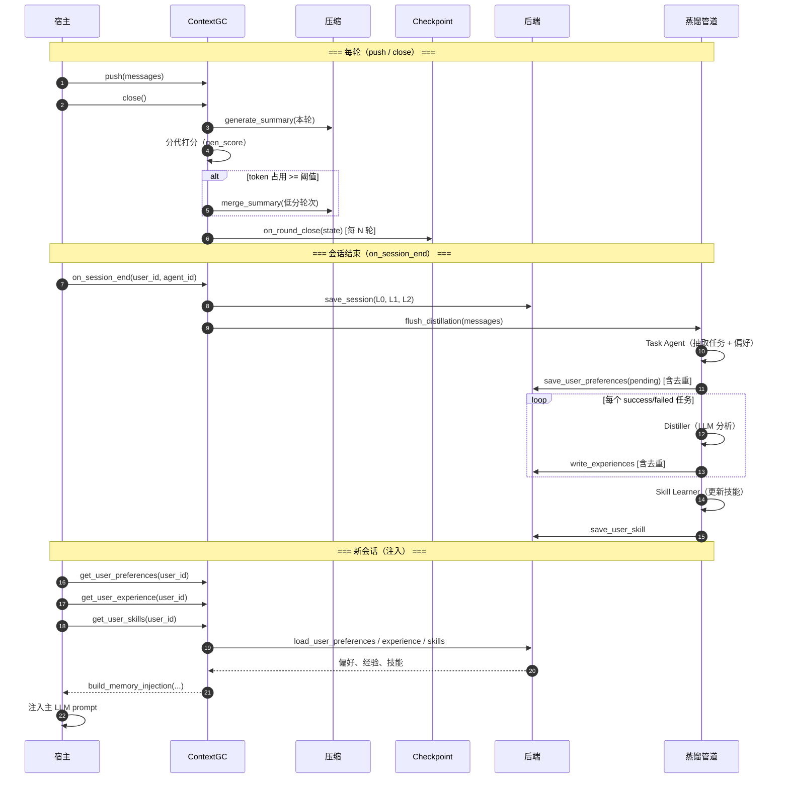

<div align="center">


# Context GC

**面向 LLM Agent 的上下文代谢与记忆沉淀引擎**

*压缩 · 持久化 · 蒸馏 · 注入 — 面向生产环境的完整上下文生命周期*

<br>

[](https://github.com/4XII-Khan/Context-GC/releases)
[](https://www.python.org/downloads/)
[](LICENSE)
[](tests/)
[](#)

<br>

<code>Python</code> · <code>AsyncIO</code> · <code>模型无关</code> · <code>零依赖</code> · <code>后端可插拔</code>

<br>

[设计文档](docs/design/memory-system.md) · [为什么](#为什么-context-gc) · [快速开始](#快速开始) · [核心能力](#核心能力) · [时序图](#完整时序图) · [评测](#100-轮集成测试) · [文档](#设计文档)

<br>

**分代压缩** · **L0/L1/L2 分层记忆** · **蒸馏管道** · **崩溃恢复** · **技能学习**

<br>

[English](README.md) · [中文](README.zh-CN.md)

</div>

---

## 为什么 Context GC？

**Context GC** 把上下文当作可回收资源：按相关性保留、按老化度代谢、按价值沉淀。让 AI 的记忆可延续、更懂你，而不是更长。

LLM 上下文窗口有限，对话却会不断增长。传统方案要么**盲目截断**（丢掉关键上下文），要么**均匀压缩**（在不相关历史上浪费 token），要么**依赖向量数据库**（增加基础设施复杂度）。Context GC 采用另一种思路：把上下文管理当作**垃圾回收问题**——保留重要的、压缩老化的、将知识沉淀到长期记忆。

### Context GC vs. 传统方案

| 维度 | 截断 | 固定摘要 | 向量检索记忆 | ✨ Context GC |
| ---- | ---- | -------- | ------------ | ------------- |
| **典型代表** | 简单实现、部分框架 | 均匀每轮摘要 | OpenViking、语义检索类方案 | 本项目 |
| 💰 部署成本 | 无 | 低 | 高（VectorDB） | ✅ 零基础设施 |
| 🎯 上下文质量 | ❌ 丢失旧上下文 | ⚠️ 均匀压缩 | ⚠️ 检索噪声 | ✅ 分代保留重要轮次 |
| 🧠 长期学习 | ❌ 无 | ❌ 无 | ❌ 无 | ✅ 蒸馏 → 偏好/经验/技能 |
| 🔄 崩溃恢复 | ❌ 无 | ❌ 无 | N/A | ✅ 每 N 轮 Checkpoint |
| ⚡ LLM 成本 | 无 | 高（每轮） | Embedding 成本 | ✅ 步进打分；偏好仅在蒸馏阶段消耗 LLM |

与 Claude Code、OpenViking、MemGPT 等**具体方案**的深度对比见 [Comparisons](docs/comparisons/claude-code.md) 及同目录下各独立文档。

---

## 核心能力

**有选择的记忆，才有真正的智能。** 无选择的记忆只是存储；有选择的记忆才接近「理解」。Context GC 在回答：什么样的记忆机制，能让 Agent 更像在理解，而不是在背诵？答案是：能分清重要与次要、能随时间代谢与沉淀、能在新会话中延续和注入的记忆。不是为了更长，而是为了更有结构、更有延续性。

### 1. 会话内压缩

**从「截断」到「代谢」。** 人类记忆是代谢式的：重要的事被记住，琐碎的会被压缩或遗忘，但遗忘不等于消失——它们塑造了直觉和习惯。LLM 原先只有两种模式：要么全部记住，要么一刀截断。Context GC 引入第三种：代谢。低相关性的轮次不是被丢弃，而是被合并为更精炼的摘要；被压缩的是形式，延续的是认知。对话的语境是流动的（A → B → 回到 A）；均匀处理每一轮，等于忽视这种流动。分代打分保留「当前最需要的」，沉淀「长期仍有价值的」。*遗忘是选择，而不是损失。*

在固定上下文窗口内支撑长对话，通过**分代垃圾回收**：按关联度语义打分、保留高价值轮次、合并低价值历史。

| 能力 | 说明 |
| ---- | ---- |
| **增量摘要** | 每轮产出结构化摘要（主题、要点、结论）；输入 = 历史摘要 + 本轮消息 |
| **分代打分（`gen_score`）** | 每轮关联度排序：前 50% → 老生代（+1），后 50% → 新生代（−1）；每轮 ±1 限制，平滑衰减 |
| **容量阈值触发合并** | Token 占用达可配置档位（20%/30%/40%…）时，低 `gen_score` 轮次相邻合并；高分代保留 |
| **步进式打分** | 每隔 N 轮打一次分，中间轮次沿用上次 `gen_score` — 降低 LLM 调用频率 |
| **自动流水线** | 摘要与合并在 `close()` 内执行；宿主仅推送消息并在每轮调用 `close()` |

### 2. 会话级记忆持久化

**从「消费」到「培育」。** 原始上下文像一次性燃料：用完就丢。Context GC 把它变成可培育的土壤：**压缩**把当下对话收束成可复用的结构，**持久化**放进 L0/L1/L2 让历史可检索、可回溯，**蒸馏**从会话中提炼偏好、经验和技能，**注入**让新会话一开始就带着这些沉淀。每一次对话都在为后续对话积累养分，而不是单纯消耗 token。知识是可累积的，Agent 随用户一起成长。不丢弃，而是分层复用。

会话结束时将对话状态持久化为**三层检索结构**；支持跨会话检索，无需向量数据库。

| 能力 | 说明 |
| ---- | ---- |
| **L0 / L1 / L2 分层存储** | **L0**：会话级总述（推荐 `default_generate_l0`：用户意图→做了什么→结果）；**L1**：GC 分轮摘要；**L2**：`push` 原样 JSON 全量写入 `content.md`（含宿主扩展字段如 tools/steps） |
| **Checkpoint 与崩溃恢复** | 每 N 轮增量 checkpoint；进程崩溃后从最后断点恢复，无数据丢失 |
| **用户偏好（仅蒸馏）** | `close()` 不做正则/规则检测；偏好仅在 `flush_distillation`（Task Agent 等）写入并去重 |
| **跨会话关键词检索** | FTS5 / BM25 全文检索 L0/L1；无嵌入向量、无向量库；可按用户/Agent 过滤会话 |

### 3. 记忆蒸馏与长期学习

**从「会话」到「关系」。** 单次会话是点，关系是线。若 Agent 每轮对话都从零开始，就很难形成「关系感」。Context GC 的目标是：让 Agent 在跨会话中保持对用户的认知——偏好、习惯、成功与失败的模式。用户不用一遍遍解释「我喜欢简洁」「别用 var」，Agent 会逐渐「认识」这个人。这不是在优化一个函数，而是在设计一种可持续的人机关系。

从已完成会话中抽取**用户偏好**、**用户经验**、**私有化技能**，通过可配置蒸馏管道持续学习。

| 能力 | 说明 |
| ---- | ---- |
| **三阶段管道** | **Task Agent** → 抽取带成功/失败标注的任务；**Distiller** → 分析执行结果；**Writers** → 写入偏好、经验、技能更新 |
| **用户偏好** | 写作风格、编码习惯、纠正记录、显式偏好；按用户存储；写入时去重（`exact` / `keyword_overlap`）；会话开始时注入 |
| **用户经验** | 按任务划分的成功模式与失败反模式；每任务独立目录；用于决策优化 |
| **技能（公共 / 私有）** | 公共：跨用户共享；私有：用户级；均可通过蒸馏更新 |
| **去重与冲突处理** | 语义去重：`exact` / `keyword_overlap` / `llm_similar`；冲突策略：`append` / `newer_wins` / `keep_both` / `llm_merge` |
| **记忆生命周期** | 偏好/经验 TTL 老化淘汰；`memory_inject_max_tokens` 控制注入容量上限 |
| **成本预算** | 蒸馏管道 token 预算封顶；超限时自动跳过低优先级任务 |

### 4. 架构特点

**零基础设施的哲学——嵌入而非替代。** 不要求向量库、不要求新服务、核心零依赖，Context GC 是嵌入式的。它不取代现有架构，而是融入宿主系统，为任意 Agent 提供可选的记忆与压缩能力。好的能力应当可被嵌入，而不是强迫宿主重构世界。

| 特性 | 说明 |
| ---- | ---- |
| **纯库嵌入** | 宿主注入回调；无强制服务，进程内运行 |
| **模型无关** | `generate_summary`、`merge_summary`、`compute_relevance`、`estimate_tokens` 由宿主注入 — 可接入任意 LLM 或启发式 |
| **后端可插拔** | `MemoryBackend` 协议：SQLite、文件系统、对象存储等 |
| **零依赖** | 核心仅用 Python 标准库；dev/example 为可选 extras |

## 快速开始

### 安装

核心包零第三方依赖，仅用 Python 标准库。

```bash
pip install -e .              # 安装核心包（可编辑模式）
pip install -e ".[dev]"       # 安装核心 + 测试依赖（pytest, pytest-asyncio, python-dotenv）
pip install -e ".[example]"   # 安装核心 + 示例依赖（openai, python-dotenv）
```

### 配置（E2E 与示例须配置模型）

```bash
cp .env.example .env
# 编辑 .env，填入 CONTEXT_GC_API_KEY 等
```

### 会话内压缩示例

**方式一：使用默认适配器**（推荐快速上手）

配置 `.env` 后，调用 `ContextGCOptions.with_env_defaults()` 即可，LLM、token 估算、关联度均从环境变量与内置默认实现获取。需安装 `pip install context-gc[example]`。

```python
from context_gc import ContextGC, ContextGCOptions

# 从环境变量读取 CONTEXT_GC_API_KEY、CONTEXT_GC_BASE_URL、CONTEXT_GC_MODEL
opts = ContextGCOptions.with_env_defaults(max_input_tokens=5000)
gc = ContextGC(opts)

# 每轮
gc.push([{"role": "user", "content": "..."}, {"role": "assistant", "content": "..."}])
await gc.close()  # 摘要 + 分代 + 合并 + checkpoint

# 获取上下文
messages = await gc.get_messages(current_messages)
```

**方式二：自定义回调**

需控制摘要策略、关联度算法或接入自有 LLM 时，可自行实现回调并传入，支持部分覆盖默认值：

```python
opts = ContextGCOptions.with_env_defaults(
    max_input_tokens=5000,
    compute_relevance=my_embedding_relevance,  # 仅覆盖关联度，其余用默认
)
```

完整自定义示例见 [`examples/`](examples/)。

### 记忆持久化 + 蒸馏示例

```python
from context_gc import ContextGC, ContextGCOptions, FileBackend, build_memory_injection, default_generate_l0

backend = FileBackend(data_dir="./data")
gc = ContextGC(opts, session_id="sess_001", backend=backend)

# ... 多轮对话（push / close）...

# 会话结束：L0/L1/L2 持久化 → 蒸馏管道 → 清理 checkpoint（L0 建议注入 default_generate_l0）
result = await gc.on_session_end(
    user_id="u1", agent_id="agent_1", generate_l0=default_generate_l0
)

# 新会话：加载偏好、经验、技能注入 prompt
prefs = await gc.get_user_preferences("u1")
exps = await gc.get_user_experience("u1")
skills = await gc.get_user_skills("u1")
injection = build_memory_injection(preferences=prefs, experiences=exps, skills=skills)
```

完整用例见 [`examples/context_gc_with_storage.py`](examples/context_gc_with_storage.py)。

---

## 完整时序图

端到端生命周期：会话内压缩 → 持久化 → 蒸馏 → 注入。



---

## 实现进度

### 1. 会话内压缩

| 模块 | 状态 | 说明 |
|------|------|------|
| 增量摘要 + 分代打分 | ✅ 已实现 | `core.py` + `generational.py` + `state.py` |
| 容量阈值触发合并 | ✅ 已实现 | `compaction.py`，梯度控制压缩比 |

### 2. 会话级记忆持久化

| 模块 | 状态 | 说明 |
|------|------|------|
| MemoryBackend 协议 + FileBackend | ✅ 已实现 | `storage/backend.py` + `storage/file_backend.py` |
| L0/L1/L2 分层存储 | ✅ 已实现 | 会话结束时 `on_session_end()` 写入 |
| Checkpoint 崩溃恢复 | ✅ 已实现 | `storage/checkpoint.py`，每 N 轮增量写入 |
| 用户偏好经蒸馏写入 | ✅ 已实现 | `distillation/flush.py` + Task Agent；无 `close()` 正则检测 |
| 跨会话关键词检索 | ✅ 已实现 | FTS5/BM25，无向量 DB |
| 会话过期清理 | ✅ 已实现 | `storage/cleanup.py` |

### 3. 记忆蒸馏与长期学习

| 模块 | 状态 | 说明 |
|------|------|------|
| 蒸馏管道 | ✅ 已实现 | `distillation/`：Task Agent → Distiller → 经验/技能 |
| 偏好去重 | ✅ 已实现 | `save_user_preferences`，exact / keyword_overlap |
| 经验去重 | ✅ 已实现 | `experience_writer.py`，keyword_overlap |
| 记忆生命周期 | ✅ 已实现 | `memory/lifecycle.py`，TTL 老化 + 注入容量控制 |

### 4. 测试

| 模块 | 状态 | 说明 |
|------|------|------|
| 单元测试 | ✅ 已实现 | 30 个用例 |
| E2E 集成测试 | ✅ 已实现 | 7 个 Case，52/53 通过 |
| 100 轮集成测试 | ✅ 已实现 | 101 轮，73% 压缩比 |

## 测试

**测试记录表**（每次跑测后登记：数据、结果、时间）：[`docs/testing/TEST_RECORD.md`](docs/testing/TEST_RECORD.md)

按核心能力组织测试。运行全部单元测试：

```bash
python3 -m pytest tests/ -v
```

### 能力与测试对应

| 核心能力 | 测试文件 | 覆盖内容 |
| -------- | -------- | -------- |
| **1. 会话内压缩** | `test_generational.py` | 分代打分（衰减、clamp） |
| | `test_100_rounds.py` | 101 轮集成：增量摘要、分代标注、容量阈值触发合并 |
| | `test_e2e_cases.py`（Case 1、2） | 摘要 + 分代打分；容量触发合并 |
| | `test_e2e_asme.py`（ASME-1、2） | **真实 ASME 对话**：会话内压缩、容量触发合并 |
| **2. 会话级记忆持久化** | `test_storage.py` | L0/L1/L2 存读、跨会话关键词检索（FTS5）、Checkpoint 写入/恢复/清理、会话过期 |
| | `test_memory.py` | 记忆生命周期 + 注入 |
| | `test_e2e_cases.py`（Case 3、4、5） | 偏好仅蒸馏/mock flush 持久化；Checkpoint 崩溃恢复；全链路 |
| | `test_e2e_asme.py`（ASME-3） | **真实 ASME 对话**：全链路持久化与跨会话检索 |
| **3. 记忆蒸馏与长期学习** | `test_storage.py` | 偏好（含去重）、经验、技能持久化 |
| | `test_memory.py` | 生命周期：TTL 老化、记忆注入、token 上限 |
| | `test_distillation.py` | 管道组件：TaskSchema、DistillationOutcome、TaskToolContext（任务、偏好） |
| | `test_e2e_cases.py`（Case 5、6、7） | 全链路 + 蒸馏管道 + 经验/技能跨会话 |

### 端到端集成测试（7 Case）

覆盖全部核心能力的端到端测试。需在 `.env` 中配置 LLM API Key：

```bash
cp .env.example .env   # 填入 CONTEXT_GC_API_KEY
python3 tests/test_e2e_cases.py
```

| Case | 核心能力 | 说明 | 结果 | 耗时 |
| ---- | -------- | ---- | ---- | ---- |
| 1 | 会话内压缩 | 5 轮：摘要 + 分代打分 + get_messages | 5/5 ✓ | ~3s |
| 2 | 会话内压缩 | 10 轮、小容量：容量触发合并 | 4/4 ✓ | ~9s |
| 3 | 会话级持久化 | 5 轮：无 close 规则偏好；mock flush → 持久化 → 加载 | 4/4 ✓ | ~1.4s |
| 4 | 会话级持久化 | 8 轮，第 5 轮后模拟崩溃：Checkpoint 恢复 | 4/5 ✓ | ~5s |
| 5 | 全链路 | 8 轮：会话 → L0/L1/L2 持久化 → 新会话加载 → 跨会话检索 → 记忆注入 | 17/17 ✓ | ~6s |
| 6 | **蒸馏管道** | 10 轮：Task Agent → 蒸馏分析 → 经验写入 → 技能学习 | 9/9 ✓ | ~19s |
| 7 | **经验/技能跨会话** | 新会话加载经验+技能 → 记忆注入 → 生命周期 TTL（无 LLM 调用） | 9/9 ✓ | ~2ms |

**总结**：52/53 检查通过 · 总耗时约 45s

报告输出：`tests/output/YYYY-MM-DD/e2e_test_report.txt`（按日期建目录）

### ASME 智能体对话 E2E 评测

基于 **ASME 个人助手智能体**真实会话记录的深度评测。使用 `tests/data/chatme_*.json` 中的会话数据，验证 Context GC 在真实智能体场景下的能力。

```bash
cp .env.example .env   # 填入 CONTEXT_GC_API_KEY
python3 tests/test_e2e_asme.py
# 或
python3 -m pytest tests/test_e2e_asme.py -v -s
```

| Case | 核心能力 | 说明 |
| ---- | -------- | ---- |
| ASME-1 | 会话内压缩 | 真实 ASME 多轮对话 → 摘要 + 分代打分 + get_messages |
| ASME-2 | 容量触发合并 | 真实长对话 + 小容量 → 验证合并摘要 |
| ASME-3 | 全链路 | 持久化 → 新会话加载 → 跨会话检索 → 记忆注入 |

数据来源：`tests/data/chatme_*.json`（ASME chatme_session_v1 格式）

报告与目录：`tests/output/YYYY-MM-DD/asme_e2e/`。场景 A 下所有 chatme **共用** `shared_data/` 作为 FileBackend 根（`sessions/`、`user/` 等）；各文件结果在 `per_session/<会话>/`（`report.txt`、`stages.json`，说明见该目录下 **`README.txt`**）。场景 B 使用 `merged_session/data/`。详见设计文档 **「十二、端到端验证场景 → 场景 6」**：`docs/design/memory-system.md`。

汇总表格：`asme_e2e/summary_table.txt`

### 100 轮集成测试

针对**会话内压缩**的端到端评测。需在 `.env` 中配置 LLM API Key：

```bash
cp .env.example .env   # 填入 CONTEXT_GC_API_KEY
python3 -m pytest tests/test_100_rounds.py -v -s
```

数据来源：`tests/data/dialogues.md`（101 轮 AI 教育主题对话，约 1.3 万 token）

| 指标 | 原文 | 压缩后 |
|------|------|--------|
| 轮数 | 101 轮 | 21 条摘要 |
| 总 token | 12,782 | 3,467 |
| 压缩比 | - | 约 73% |
| 单轮摘要 | 101 次 | 102 次 |
| 合并摘要 | - | 14 次 |

| 维度 | 评分 | 说明 |
|------|------|------|
| 主题覆盖 | ★★★★★ | 101 轮主题无遗漏 |
| 逻辑连贯 | ★★★★★ | 主线清晰，立场一致 |
| 核心信息保留 | ★★★★☆ | 论点与框架保留好，细节适度压缩 |
| 可回溯性 | ★★★★☆ | 单轮摘要可回溯，合并摘要需查原文补细节 |

**结论**：摘要逻辑损失可接受，无明显信息断层；具体案例、精确数据在合并时有所弱化，但不影响整体理解。

### 输出文件

- `tests/output/YYYY-MM-DD/test_100_rounds_log.txt`：单轮摘要与合并摘要的完整记录
- `tests/output/YYYY-MM-DD/test_100_rounds_final_context.txt`：最终上下文完整摘要（压缩后）
- `tests/output/YYYY-MM-DD/test_100_rounds_evaluation.md`：评估报告（含数据概览，每次运行自动生成）

## 项目结构

```
context-gc/
├── src/
│   └── context_gc/
│       ├── __init__.py          # 包入口，re-export 所有核心类
│       ├── core.py              # 主类 ContextGC + ContextGCOptions
│       ├── state.py             # RoundMeta, ContextGCState
│       ├── compaction.py        # 容量阈值检查与合并摘要
│       ├── generational.py      # 分代打分（衰减 + clamp + 步进）
│       │
│       ├── storage/             # 持久化层
│       │   ├── backend.py       # MemoryBackend Protocol + 数据类
│       │   ├── file_backend.py  # 文件系统后端实现
│       │   ├── checkpoint.py    # Checkpoint 崩溃恢复
│       │   └── cleanup.py       # 会话过期清理
│       │
│       ├── memory/              # 记忆管理
│       │   └── lifecycle.py     # 老化/淘汰/注入容量控制
│       │
│       └── distillation/        # 蒸馏管道
│           ├── flush.py         # 管道入口
│           ├── models.py        # 数据模型
│           ├── task_agent.py    # Task Agent（任务提取）
│           ├── distiller.py     # 蒸馏（成功/失败分析）
│           ├── skill_learner.py # Skill Learner（技能更新）
│           └── experience_writer.py  # 经验写入 + 去重
│
├── tests/
│   ├── test_storage.py          # FileBackend + Checkpoint
│   ├── test_memory.py           # Lifecycle + 注入
│   ├── test_generational.py     # 分代打分
│   ├── test_distillation.py     # 蒸馏模型与工具
│   ├── test_e2e_cases.py        # E2E 集成（7 Case）
│   ├── test_e2e_asme.py        # ASME 智能体对话 E2E 评测
│   ├── test_100_rounds.py       # 100 轮压缩评测
│   └── data/
│       ├── dialogues.md        # 100 轮测试数据
│       ├── chatme_loader.py    # ASME chatme 数据加载器
│       └── chatme_*.json       # ASME 真实会话记录
│
├── examples/
│   └── context_gc_with_storage.py  # 完整持久化 + 蒸馏示例
│
├── docs/
│   ├── design/
│   │   ├── memory-system.md              # 完整设计（13 章）
│   │   └── context-compression.md        # 会话内压缩设计
│   └── comparisons/                      # 竞品对比（8 个方案）
└── README.md
```

## 设计文档

**配置**

- [配置与环境变量](docs/configuration.md) — `with_env_defaults`、蒸馏相关环境变量、预设、`create_with_file_backend`、记忆注入

**Design**

- [Memory System](docs/design/memory-system.md) — **完整方案**（13 章）：L0/L1/L2 分层、蒸馏管道、Checkpoint、Harness Engineering、端到端验证
- [Context Compression](docs/design/context-compression.md) — 会话内压缩设计规范

**Comparisons**

- [Claude Code](docs/comparisons/claude-code.md) · [OpenClaw](docs/comparisons/openclaw.md) · [Cursor](docs/comparisons/cursor.md) · [AgentScope](docs/comparisons/agentscope.md) · [LangGraph](docs/comparisons/langgraph.md) · [OpenViking](docs/comparisons/openviking.md) · [Sirchmunk](docs/comparisons/sirchmunk.md) · [MemGPT](docs/comparisons/memgpt.md)

---

## 📄 开源协议

本项目采用 [Apache License 2.0](LICENSE) 协议开源。

